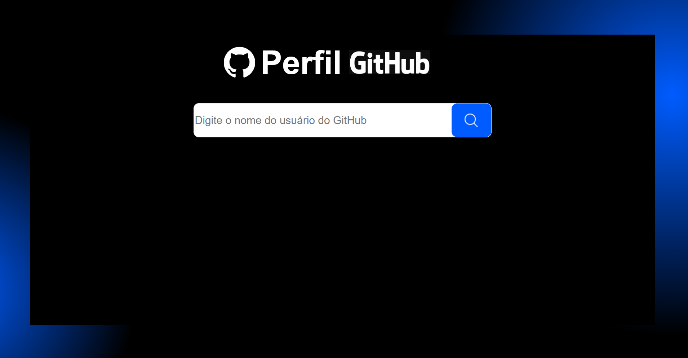
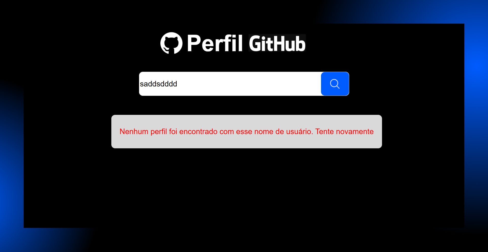

# 🔍 GitHub Profile Search

Projeto criado com **React + Vite** que permite buscar perfis públicos do GitHub e exibir informações de forma organizada, seguindo um layout proposto no Figma.

## 📝 Objetivo

Desenvolver uma aplicação onde o usuário possa pesquisar perfis do GitHub e visualizar as principais informações de forma estilizada.

## 🎨 Layout no Figma

[Acesse o layout](https://www.figma.com/proto/DqtFxC6312M32mLt8FpJjq/inovation-class?page-id=22%3A2864&node-id=22-4293&viewport=359%2C115%2C0.25&t=SHsEqEgaMrXGMKwv-1&scaling=scale-down-width&content-scaling=fixed&starting-point-node-id=22%3A4293&show-proto-sidebar=1)

## ✅ Funcionalidades

- [x] Campo de busca com input controlado (`SearchBar.jsx`)
- [x] Requisição à [API do GitHub](https://api.github.com/users/{username}) (`api.js`)
- [x] Exibição de:
  - Nome do usuário
  - Foto de perfil
  - Bio
- [x] Tratamento de erro caso o usuário não seja encontrado (`Error.jsx`)
- [x] Componente de carregamento (`Loading.jsx`)
- [x] Interface responsiva e estilizada conforme o Figma
- [x] Organização de código por responsabilidade: `components`, `services`, `assets`

## 📂 Estrutura do Projeto

```
GITHUB_PROFILE_SEARCH/
├── public/
├── src/
│   ├── assets/
│   │   └── react.svg
│   ├── components/
│   │   ├── Error.jsx
│   │   ├── Loading.jsx
│   │   ├── SearchBar.jsx
│   │   └── UserProfile.jsx
│   ├── services/
│   │   └── api.js
│   ├── App.jsx
│   ├── App.css
│   ├── index.css
│   ├── style.css
│   └── main.jsx
├── index.html
├── package.json
├── vite.config.js
└── README.md
```

## ⚙️ Tecnologias utilizadas

- [React](https://reactjs.org/)
- [Vite](https://vitejs.dev/)
- [Axios](https://axios-http.com/) – para requisições HTTP
- [CSS Modules / Custom CSS] – estilização personalizada
- [GitHub REST API](https://docs.github.com/en/rest/users/users?apiVersion=2022-11-28)

## ▶️ Como rodar o projeto localmente

1. Clone o repositório:
```bash
git clone https://github.com/wilk2308/github_profile_search.git
```

2. Acesse o diretório do projeto:
```bash
cd GITHUB_PROFILE_SEARCH
```

3. Instale as dependências:
```bash
npm install
```

4. Rode o projeto:
```bash
npm run dev
```

5. Acesse no navegador:
```
http://localhost:5173
```

## 📸 Demonstração

##  Demonstração






## 👨‍💻 Autor

Desenvolvido por [Will Sousa](https://github.com/wilk2308/) 🚀
